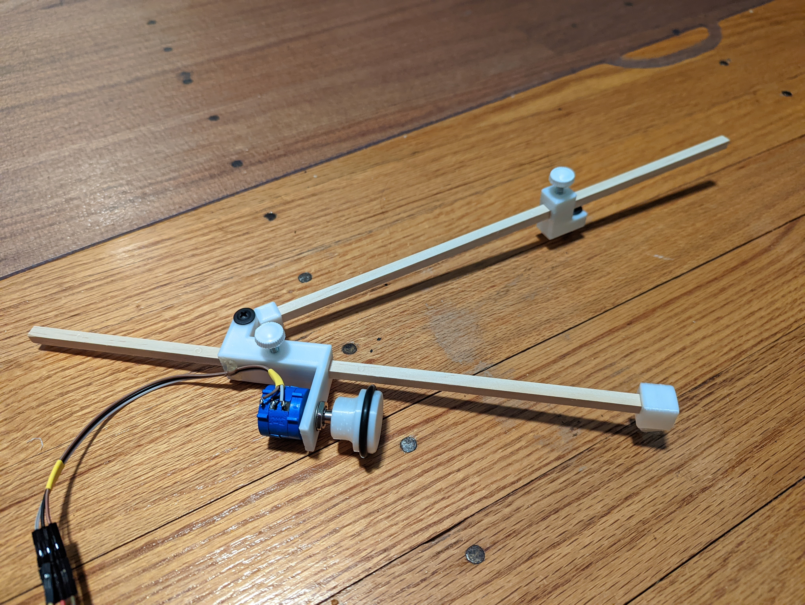

# Planimeter
A 3D Printable digital planimeter. 

By using off-the-shelf hardware and using a simple potentiometer to measure the rotation of the wheel, this is cheap to build and accessible to a wide audience.

To build this, you will need:

- [a 10-turn potentiometer](https://www.amazon.com/HiLetgo-3590S-2-103L-10-Turn-Precision-Potentiometer/dp/B079JN626M/), any will do so long as it has a shaft diameter of 1/4 inch and a threaded diameter of 0.36 inches. These typically come with a 1/2 inch nut.
- [two 1/4 inch wooden square dowels](https://www.amazon.com/gp/product/B08HQX2Q13/). These are the connecting rods of the planimeter.
- [one #18 O-ring](https://www.lowes.com/pd/Danco-10-Pack-1-3-16-in-x-1-8-in-Rubber-Faucet-O-Ring/3369366), with a 1 3/16 inch outer diameter and 1/8 inch cross-section diameter. This forms the grippy rolling surface of the wheel.
- [two #8 3/4 inch truss head screws](https://www.amazon.com/gp/product/B0002ZPF12/). One of these forms the point of the stationary pivot, the other acts as a hinge pin.
- [Two M4 threaded thumb screws](https://www.amazon.com/dp/B097HD2CZF). These are used to secure the rods. Thumb screws are used so that the rod lengths are adjustable, but regular M4 screws could be used if you are fine with getting out a screw driver whenever you adjust the rods.

Of course, the design is parametric, so you can modify it to suit whatever hardware is most readily available to you. You may find an M4 thread tap helpful to form the threads. Depending on the specific characteristics of your printer and filament, you may find that an m4 screw works as a good enough thread tap. You also need a way to drive the potentiometer nut (an adjustable wrench works well) and the pan head screws (a screw driver is ideal).

You will need one copy of each part printed. Because we rely on threads cut into the plastic, there needs to be a substantial wall thickness. Because the elbow and shoulder are in tension when the knobs are screwed down, they need adequate infill to resist this.

Once printed, assemble the parts as in the above photo. A good improvement would be to include a screw to hold the potentiometer wires. As seen above, the current solution is hot glue.

I have not provided code to process the signal from the potentiometer into an area. This naturally depends on the specific lengths of rod you have chosen, which are adjustable by design. The change in voltage at the wiper (before versus after the tracing operation) will be proportional to the area swept out. You can work out this constant algebraically using some calculus, or empirically by tracing a known area. It would be a good exercise to do both and compare answers. You can also show that the constant depends only on the length of the rod going to the tracer, not on the length of the rod going to the shoulder.